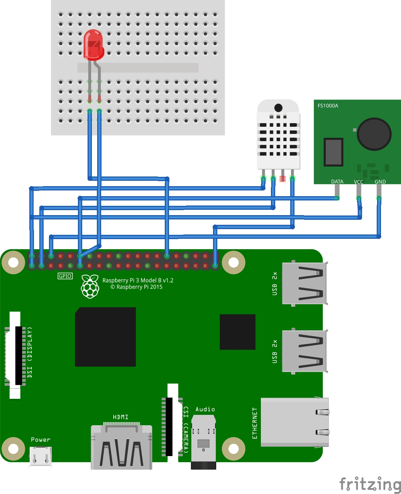

# DeskPlanner

DeskPlanner is a web-based planning tool designed specifically for Raspberry Pi systems. It integrates various sensors and GPIO controls to provide a seamless user experience for managing deadlines, exercises, and more. Leveraging Apache2 and PHP for the web server, alongside Python scripts for hardware interactions, DeskPlanner offers a robust solution for personal and educational projects.

## Table of Contents

- [Features](#features)
- [Prerequisites](#prerequisites)
- [Installation](#installation)
  - [1. Install Git](#1-install-git)
  - [2. Clone the Repository](#2-clone-the-repository)
  - [3. Run the Installation Script](#3-run-the-installation-script)
- [What the Installation Script Does](#what-the-installation-script-does)
- [Warnings](#warnings)
- [Usage](#usage)
- [Troubleshooting](#troubleshooting)
- [Contributing](#contributing)
- [License](#license)

---

## Features

- **Web Interface:** Manage deadlines, exercises, and user data through an intuitive web interface.  
- **Sensor Integration:** Utilize GPIO pins to interact with LEDs, sockets, and temperature sensors.  
- **Dynamic Configuration:** Automatically adapts to different installation directories.  
- **Apache & PHP Integration:** Serves the web application efficiently with Apache2 and PHP support.

---

## Prerequisites

Before installing DeskPlanner, ensure that your Raspberry Pi setup meets the following requirements:

### Hardware

- Raspberry Pi (preferably Raspberry Pi 3 or later)  
- MicroSD card with Raspberry Pi OS installed  
- Power supply for Raspberry Pi  
- Internet connection (Ethernet or Wi-Fi)  
- 6 x FF Jumper Wire
- 2 x MF Jumper Wire
- DHT22 temperature sensor
- 433 MHz transmitter
- 433 MHz wireless socket
- LED
- Breadboard

## Wiring Diagram
webserver/img/DeskPlanner_Steckplatine.jpg



### Software

- Raspberry Pi OS (preferably the Lite version for headless setups)  
- SSH access (optional but recommended for headless installations)

---

## Installation

Follow these step-by-step instructions to set up DeskPlanner on your Raspberry Pi.

### 1. Install Git

Git is required to clone the DeskPlanner repository from GitHub.

```bash
sudo apt-get update
sudo apt-get install -y git
```
### 2. Clone the Repository

1. **Navigate to Your Desired Installation Directory**  
   It's common to place projects in the `/home/pi` directory. You can create a directory for projects if it doesn't exist:
```bash
   cd /home/pi
   mkdir Projects
   cd Projects
```
### 2. Clone the Repository

1. **Navigate to Your Desired Installation Directory**  
   It's common to place projects in the `/home/pi` directory. You can create a directory for projects if it doesn't exist:
   ```bash
   cd /home/pi
   mkdir Projects
   cd Projects
   ```   
3. Clone the DeskPlanner Repository
```bash
  git clone https://github.com/LinusPoerschke/DeskPlanner.git

```
4. Navigate to the Project Directory
```bash
  cd DeskPlanner
```

5. Run the Installation Script
```bash
   chmod +x install.sh
  ./install.sh
```
